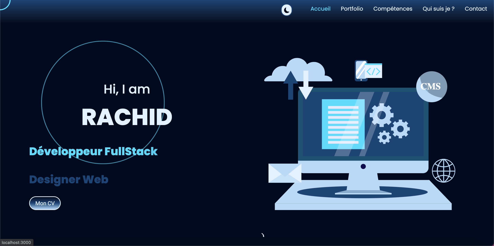
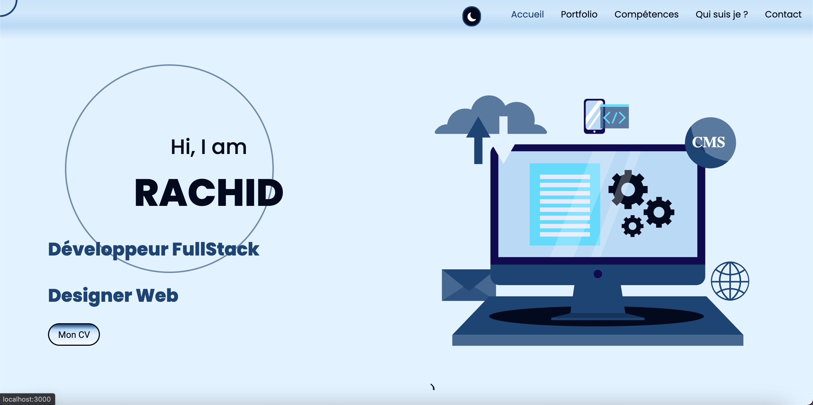

# PORTFOLIO ReactJs

Mon portfolio en reactjs :  [Demo](https://boudjenanerachid.fr).

## Mode sombre


## Mode clair


## Etapes d'installation
```bash
git clone https://https://github.com/Boudj31/portfolio.git
```
Clone le projet sur votre machine

```bash
npm install
```
Installe toutes les dépendances du projet
```bash
npm start
```
Cette commande lance le serveur de développement : [http://localhost:3000](http://localhost:3000).
